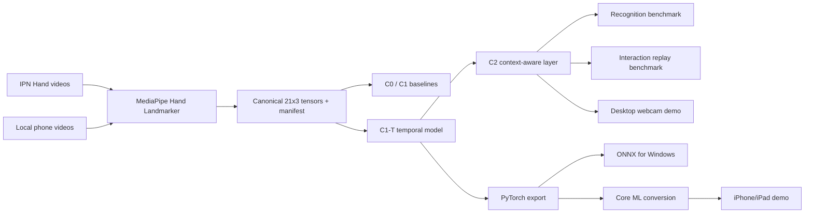
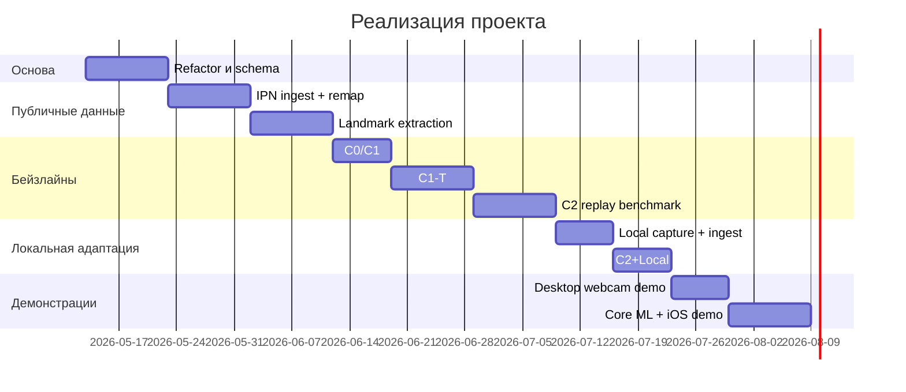

# Windows-first ТЗ для магистерского проекта Context-Aware Temporal Landmark Gesture Recognition for AR Interaction

PDF-версия для передачи агентам: [скачать файл](sandbox:/mnt/data/TZ_Windows_First_AR_Gesture_Research_Spec.pdf)

## Резюме

Это ТЗ фиксирует исследовательскую архитектуру, в которой основная разработка, обучение, сравнение моделей и измерение метрик выполняются на Windows-ноутбуке с RTX 5070 Ti Laptop GPU, а iPhone/iPad выступают обязательной финальной платформой демонстрации. Такой расклад реалистичен: официальная спецификация ноутбучного RTX 5070 Ti указывает 5888 CUDA-ядер, 12 GB GDDR7, 192-bit memory interface, 992 AI TOPS и диапазон мощности 60–115 W, чего с запасом хватает для компактных temporal landmark models и многократных воспроизводимых ablation-экспериментов. citeturn15view3turn16view0

Ключевое решение проекта — **public-data-first**. Основным обучающим и сравнительным корпусом должен быть поднабор IPN Hand, а локальные видео должны использоваться не как главный источник данных, а как слой domain adaptation, portability и финальной валидации. Это устраняет главный методологический риск: не нужно сначала записывать сотни почти одинаковых роликов одной и той же рукой в одном и том же освещении, если уже существует публичный набор с реальными сценами, межсубъектной вариативностью, no-gesture сегментами и сложным светом. IPN Hand содержит более 4 тысяч gesture instances, 800 тысяч RGB-кадров, 50 субъектов, 28 сцен и 13 классов жестов; в статье отдельно подчёркивается наличие непрерывного исполнения жестов без transition states и наличие естественных нецелевых движений руки. citeturn5view2turn7view0turn23view0

Главный исследовательский вывод магистерской должен строиться не только на метриках распознавания, но и на метриках взаимодействия. Поэтому спецификация требует сравнивать не просто C0/C1/C1-T по accuracy и macro F1, а полный стек: rule-based baseline, classical ML, temporal model, context-aware interaction layer и вариант с локальной адаптацией. Именно связка **temporal recognizer + context-aware interaction policy + local adaptation after public pretraining** и образует содержательную новизну проекта. Это позволяет показать не только «модель стала точнее», но и «система стала реже ошибочно активировать действия, быстрее приводить к корректному действию и лучше переноситься в реальную съёмку». Это заключение опирается на свойства MediaPipe Hand Landmarker как универсального источника 21 hand keypoints, а также на официальные возможности современных PyTorch, ONNX Runtime и Core ML Tools для построения переносимого ML pipeline. citeturn17view3turn5view0turn5view4turn29view1turn30view1

**Рекомендация по ходу работ:** не начинать всё заново «с чистого листа», а сделать **controlled refactor** текущего репозитория под новую постановку задачи. Перезапуск с нуля даст меньше пользы, чем жёсткое переопределение архитектурных контрактов: жестового словаря, схем данных, benchmark runner, export pipeline и demo-модулей.

## Научная рамка и итоговый словарь жестов

Цель проекта формулируется так: создать воспроизводимую и автоматизируемую исследовательскую платформу для распознавания жестов руки по temporal landmark representation и доказать три тезиса. Во-первых, temporal landmark model превосходит rule-based и traditional ML baselines. Во-вторых, context-aware interaction layer снижает число unintended actions и улучшает task-level usability. В-третьих, небольшая локальная адаптация после предобучения на публичном наборе приносит измеримый выигрыш на локальной съёмке без требования большого собственного датасета.

Исследовательские вопросы должны быть зафиксированы в ТЗ в явном виде:

1. Насколько temporal landmark classifier превосходит C0 и C1 на subject-disjoint public benchmark?
2. Насколько context-aware interaction layer улучшает interaction-level метрики по сравнению с direct gesture-to-action mapping?
3. Насколько 25–50 локальных видео улучшают работу в реальном phone/webcam domain после public pretraining?
4. Насколько бесшовно одна и та же исследовательская модель переносится из Windows-пайплайна в iPhone/iPad demo?

Финальный обязательный словарь жестов:

| Проектная метка | Семантика | Маппинг к IPN Hand | Использование в interaction layer |
|---|---|---|---|
| `no_gesture` | отсутствие команды | `No gesture`, id 0 | подавление действий, reset/decay |
| `point_2f` | наведение двумя пальцами | `Point-2f`, id 2 | pointer/hover |
| `click_2f` | подтверждение/выбор | `Click-2f`, id 4 | select/confirm |
| `swipe_left` | движение влево | `Th-left`, id 7 | navigation / previous / rotate left |
| `swipe_right` | движение вправо | `Th-right`, id 8 | navigation / next / rotate right |
| `zoom_in` | масштабирование внутрь | `Zoom-in`, id 12 | optional transform mode |
| `zoom_out` | масштабирование наружу | `Zoom-o`, id 13 | optional transform mode |

Имена классов, их идентификаторы и примеры жестов берутся из таблицы и class sheet IPN Hand. В основной benchmark-ветке из 13 классов намеренно исключаются Point-1f, Click-1f, Throw up/down, Open-2, Double click-1f и Double click-2f, чтобы не размывать постановку и не плодить лишние interaction semantics. citeturn23view0turn7view0

Научная новизна в формулировке ТЗ должна быть зафиксирована так:

- единое каноническое представление всех видеоданных через MediaPipe 21×3 landmarks;
- прямое сопоставление публичного RGB-dataset и локального phone/webcam-domain через один extraction pipeline;
- расслаивание эксперимента на recognition-level и interaction-level;
- отдельное исследование **C2** как context-aware extension поверх temporal classifier;
- переносимый Windows-first research mainline с финальной iOS-демонстрацией.

## Данные, manifest и каноническое представление landmarks

IPN Hand должен быть главным источником обучения и объективного сравнения. Это один из самых подходящих публичных наборов именно под выбранный сценарий, потому что он уже проектировался как touchless interaction dataset: содержит 13 классов статических и динамических жестов, реальные сцены, широкий разброс длительностей, большое число непрерывных видео и явный класс no gesture. В статье также указан subject-based split: 37 субъектов и 148 видео на train, 13 субъектов и 52 видео на test, что делает subject-disjoint evaluation естественным и методологически верным режимом для thesis benchmark. citeturn5view2turn7view0

Роль локального набора должна быть чётко ограничена. Он нужен для:
- измерения domain shift между публичным набором и реальной мобильной/веб-камерной съёмкой;
- калибровки и fine-tuning после public pretraining;
- финальной демонстрации на собственной руке и собственной камере;
- проверки portability на iPhone/iPad.

**Предлагаемый объём локальных данных:**

| Локальный режим | Состав | Назначение |
|---|---|---|
| Минимальный | 25 клипов = 5 классов × 5 повторов | smoke adaptation, sanity check |
| Целевой | 50 клипов = 5 классов × 10 повторов | полноценная local adaptation stage |
| Расширенный | 70 клипов = 7 классов × 10 повторов | включение `zoom_in/zoom_out` |

Это именно **предлагаемые объёмы**, а не свойства внешнего источника. Их задача — сделать локальную съёмку компактной, но исследовательски полезной. Критически важно, что локальные ролики не должны быть «сто одинаковых дублей». Напротив, нужно целенаправленно заложить умеренную вариативность: 2–3 capture sessions, 2–3 фона, 2–3 световых условия, 30 fps, 720p или 1080p, один жест на клип, длительность 2–4 секунды. Если пользователь записывает в основном левой рукой, это не проблема: handedness bias должен компенсироваться через mirroring augmentation и явную metadata-разметку.

### Manifest и metadata schema

Основная ошибка таких проектов — хранить всё в одном JSON-файле. Для публичного benchmark это не масштабируется. В ТЗ нужно зафиксировать раздельную структуру хранения:

- **metadata layer** — `JSONL` или `CSV`;
- **tensor layer** — `NPZ` shards;
- маленькие JSON-экспорты допустимы только для toy examples и smoke tests.

Обязательные поля manifest:

```text
sample_id
source_dataset          # ipn_hand | local_phone
public_label
target_label
participant_id
session_id
repetition_id
split_group
hand_recorded           # left | right | unknown
handedness_detected     # left | right | unknown
mirrored                # bool
fps
width
height
camera_device
background_tag
lighting_tag
clip_start_ms
clip_end_ms
raw_video_path
tensor_path
notes
```

Такой manifest должен быть единственным источником правды для всех CLI: extraction, training, evaluation, replay и export.

### Канонический формат MediaPipe 21×3

MediaPipe Hand Landmarker для Python и iOS выдаёт handedness, image landmarks и world landmarks, а сама hand model локализует 21 hand keypoints. Python Tasks officially supports Windows, macOS, Linux и Python 3.9–3.12. Это позволяет сделать invariant data contract для всех этапов проекта. citeturn5view0turn17view3turn32search0

Канонический внутренний формат должен быть таким:

```text
landmarks:        float32 [T, 21, 3]
sequence_mask:    bool [T]
frame_confidence: float32 [T]
handedness_score: float32 [T] or scalar
coord_space:      image_normalized_xyz
world_landmarks:  optional float32 [T, 21, 3]
```

Рекомендуемое значение `T` для обучения — **32**. Это близко к уже сложившемуся практическому диапазону и не конфликтует с тем, что статья IPN Hand использовала 32-frame input windows для базовых 3D-CNN моделей. При этом для streaming inference нужно разрешить окна **16 / 24 / 32**, чтобы отдельно измерять delay–accuracy trade-off. citeturn7view0

### Preprocessing и normalization

Самая важная инженерная деталь ТЗ: **нельзя нормализовать динамические жесты так, чтобы исчезла глобальная motion-компонента**. Если каждый кадр центрировать по wrist и масштабировать без сохранения hand trajectory, классы `swipe_left` и `swipe_right` теряют главный дискриминативный сигнал.

Поэтому preprocessing должен быть двухканальным:

1. **pose-normalized stream**
   - центрирование по wrist или palm center;
   - scale normalization по характерному размеру ладони;
   - optional z normalization;
   - validity mask для отсутствующих/слабых кадров.

2. **global motion stream**
   - trajectory wrist / hand centroid в image plane;
   - first-order deltas;
   - optional velocity/acceleration features.

Именно этот dual-view contract должен использоваться всеми моделями: C0 — через интерпретируемые thresholds, C1 — через engineered statistics, C1-T — напрямую как temporal tensor, C2/C2+Local — через прогнозы temporal model и context layer.

### Augmentation, handedness и label swap

Mirroring должно быть обязательной частью спецификации, особенно потому, что локальные ролики могут быть по практическим причинам записаны в основном левой рукой. Но mirroring **не может** быть реализован «в лоб», иначе ломаются directed labels.

Правило должно быть таким:

- `no_gesture`, `point_2f`, `click_2f` не меняют label;
- `swipe_left` ↔ `swipe_right` меняются местами;
- `zoom_in`, `zoom_out` label не меняют.

Дополнительные augmentations:
- temporal jitter;
- random frame drop;
- Gaussian coordinate noise;
- translation jitter;
- scale jitter;
- confidence masking на низкокачественных landmarks.

### Конвейер данных



## Модели, обучение и Windows-стек

### Сравниваемые варианты

| Вариант | Что сравнивается | Обучение | Роль в исследовании |
|---|---|---|---|
| **C0** | rule-based recognizer на landmark rules и temporal thresholds | нет обучения, только калибровка порогов | нижняя интерпретируемая граница |
| **C1** | classical ML на engineered clip features | public subset | сравнение с традиционным feature-based подходом |
| **C1-T** | compact temporal landmark model | public subset | основной recognition backbone |
| **C2** | C1-T + context-aware interaction layer | backbone + validation-time calibration | thesis-level main system |
| **C2+Local** | C2 + local adaptation/fine-tuning/calibration | public pretraining + local stage | domain-transfer variant |

Такое разложение позволяет очень чётко показать, **где именно возникает улучшение**: в heuristics, в static clip features, в temporal representation, в interaction policy или в локальной адаптации.

### C1-T как основной backbone

Для основной temporal модели ТЗ должно требовать **компактную Conv1D/TCN-архитектуру**, а не тяжёлую video-CNN. Причина проста: исследование строится на landmark tensors, а не на raw RGB. На Windows-ноутбуке эта модель должна обучаться быстро, многократно, в условиях частых ablation-запусков. Для данной постановки полезнее получить 20 воспроизводимых быстрых прогонов, чем один громоздкий эксперимент с 3D-CNN.

Рекомендуемые defaults:
- optimizer: `AdamW`
- loss: `weighted cross-entropy` или `focal loss`
- scheduler: cosine decay или one-cycle
- early stopping: patience 10
- fixed seed + logged config hash
- training precision: AMP FP16 on CUDA

Официальный PyTorch рекомендует использовать `torch.amp.autocast("cuda", ...)` и `torch.amp.GradScaler("cuda", ...)`; передача `pin_memory=True` в `DataLoader` ускоряет host→GPU transfer, а `persistent_workers=True` уменьшает overhead между эпохами. Для inference-экспериментов на маленьких batch’ах допускается `torch.compile(mode="reduce-overhead")`, поскольку этот режим explicitly ориентирован на снижение Python overhead с CUDA Graphs. citeturn13view0turn13view1turn13view2turn13view3turn13view4

### Context-aware слой как отдельный исследуемый компонент

C2 не должен быть «ещё одной classifier architecture». Его смысл — **контекстно-осознанное управление interaction semantics**. Поэтому C2 должен быть формализован как слой над sequence-level probabilities C1-T.

Состав context layer:
- temporal smoothing;
- hysteresis;
- confidence thresholding;
- cooldown windows;
- finite-state machine, зависящая от UI/AR context.

Минимальный набор состояний:
- `idle`
- `hover`
- `candidate_select`
- `selected`
- `transform_mode`
- `cooldown`

Правила:
- `point_2f` двигает pointer/hover;
- `click_2f` валиден только после стабильного hover;
- `swipe_left/right` валидны только в `selected` или `menu/navigation` context;
- `no_gesture` никогда не порождает действие и используется как reset/decay signal;
- `zoom_in/out` активируются только в `transform_mode`.

Это ключевой тезис магистерской: **нужно показать, что context awareness улучшает interaction-level quality даже тогда, когда recognition-level gain умеренный**.

### Guidance для RTX 5070 Ti Laptop GPU

Исходя из официальных характеристик RTX 5070 Ti Laptop GPU, модельный бюджет у проекта комфортный: 12 GB GDDR7 и 5888 CUDA cores более чем достаточны для compact temporal landmark classifier. Это означает, что bottleneck практически наверняка будет не в обучении backbone, а в landmark extraction, replay evaluation и организации reproducible pipeline. citeturn15view3turn16view0

Практические настройки:

| Режим | Предлагаемый batch size | Precision | Оценка времени |
|---|---|---:|---:|
| C0 | — | — | минуты на настройку порогов |
| C1 | — | CPU | 1–10 минут |
| C1-T public run | 256 стартово, 512 если стабильно | AMP FP16 | 5–15 минут |
| C2 calibration | 64–256 offline | FP32/FP16 | 1–5 минут |
| C2+Local adaptation | 64–128 | AMP FP16 | 1–10 минут |
| 5-fold CV | как выше | AMP FP16 | десятки минут / несколько часов |

Это **инженерные оценки**, а не официальные vendor benchmarks. Они должны подтверждаться собственным timing script в репозитории.

### Windows-first setup

Выбор версии Python должен быть зафиксирован в ТЗ как **Python 3.11**. Это наиболее надёжное пересечение поддержек: MediaPipe Python Tasks поддерживает Python 3.9–3.12, а актуальная стабильная PyTorch требует Python 3.10+. Python `venv` официально рекомендуем для создания изолированных окружений, включая Windows workflow через `python -m venv`. citeturn5view0turn5view4turn28view0

Базовый стек:
- Windows 11 как primary OS;
- свежий Studio Driver;
- CUDA 12.x линия;
- cuDNN 9.x;
- PyTorch stable build с CUDA 12.x;
- MediaPipe Python package;
- ONNX Runtime GPU;
- OpenCV, scikit-learn, pytest.

Для ONNX Runtime важно держать стек совместимым с PyTorch: официальная документация сообщает, что `onnxruntime-gpu` 1.20.x на PyPI по умолчанию ориентирован на CUDA 12.x и cuDNN 9.x и совместим с PyTorch ≥ 2.4 для CUDA 12.x; при этом пакет умеет использовать CUDA/cuDNN DLLs из установленного PyTorch, что упрощает Windows setup. Для последних сборок cuDNN support matrix указывает совместимость CUDA 12.x line и требует Windows driver не ниже 570.65. citeturn31view0turn29view1turn15view0

PowerShell-скелет:

```powershell
py -3.11 -m venv .venv
.\.venv\Scripts\Activate.ps1
python -m pip install --upgrade pip
pip install -r requirements/windows-train.txt
pip install mediapipe
pip install onnxruntime-gpu
```

На Windows спецификация **обязана** учитывать multiprocessing nuances PyTorch: Windows uses `spawn` instead of `fork`, training entrypoints должны быть завернуты в `if __name__ == "__main__":`, а `Dataset`/`DataLoader` workers должны возвращать **CPU tensors**, потому что CUDA IPC operations на Windows официально не поддерживаются. Для воспроизводимости PyTorch прямо предупреждает, что полностью идентичные результаты не гарантируются между разными версиями, платформами и CPU/GPU, но рекомендует фиксировать `torch.manual_seed`, seed-ы Python/NumPy, отключать `cudnn.benchmark` при необходимости и использовать `torch.use_deterministic_algorithms(True)` для debugging/regression mode. citeturn27view0turn27view1turn27view2turn27view3

## Benchmark runner, метрики и автоматизация

Проект должен быть исследовательским, а значит сравнение вариантов не может строиться вокруг произвольных ручных тестов. ТЗ должно требовать **двухуровневый benchmark runner**.

### Recognition benchmark

Вход:
- canonical landmark datasets;
- subject-grouped public splits;
- session-grouped local splits;
- model config + seed.

Выход:
- accuracy;
- macro F1;
- weighted F1;
- balanced accuracy;
- per-class precision/recall/F1;
- confusion matrix;
- offline latency;
- streaming latency.

### Interaction / replay benchmark

Вход:
- prerecorded videos или landmark sequences;
- expected gesture-event timeline;
- interaction scenario spec;
- recognizer variant.

Выход:
- task success rate;
- unintended action rate;
- false trigger rate per minute;
- median gesture-to-action latency;
- action precision/recall;
- correction count per task;
- time-to-complete scripted tasks.

Именно этот второй уровень должен стать основанием для фразы «context-aware variant улучшил взаимодействие». Если interaction benchmark не реализован, то магистерская рискует остаться просто работой про классификацию последовательностей.

### Метрики, которые нужно публиковать

| Уровень | Обязательные метрики |
|---|---|
| Recognition | accuracy, macro F1, weighted F1, balanced accuracy, per-class F1 |
| Streaming | median latency, p95 latency, false activation rate |
| Interaction | task success rate, unintended action rate, action precision/recall, gesture-to-action latency, corrections per task |
| Portability | desktop vs local vs iOS consistency, on-device latency, export equivalence |

### Repo structure

Рекомендуемая структура:

```text
project_root/
  configs/
    datasets/
    preprocessing/
    train/
    interaction/
    export/
    demo/
  data/
    raw/
      ipn_hand/
      local_phone/
    interim/
      manifests/
    processed/
      public_landmarks/
      local_landmarks/
      merged/
  docs/
    TZ_windows_first_ru.md
    capture_protocol.md
    benchmark_design.md
  research_pipeline/
    cli/
    data/
    features/
    models/
    interaction/
    evaluation/
    export/
    utils/
  demo/
    webcam_app/
  ios_demo/
    GestureAR/
  tools/
    render_tz_pdf.py
    validate_manifest.py
  tests/
    unit/
    integration/
    smoke/
```

### CLI-контур

Ниже — обязательный минимум команд, который агенты должны реализовать как публичный интерфейс проекта:

```bash
python -m research_pipeline.cli.build_ipn_manifest --root <IPN_ROOT> --output data/interim/manifests/ipn_all.jsonl
python -m research_pipeline.cli.remap_ipn_subset --input data/interim/manifests/ipn_all.jsonl --output data/interim/manifests/ipn_subset.jsonl
python -m research_pipeline.cli.extract_landmarks --manifest data/interim/manifests/ipn_subset.jsonl --output-dir data/processed/public_landmarks
python -m research_pipeline.cli.ingest_local_videos --manifest data/interim/manifests/local_capture.csv --video-dir <LOCAL_VIDEO_ROOT> --output data/interim/manifests/local.jsonl
python -m research_pipeline.cli.merge_datasets --inputs data/interim/manifests/ipn_subset.jsonl data/interim/manifests/local.jsonl --output data/interim/manifests/merged.jsonl
python -m research_pipeline.cli.train --config configs/train/c1_rf.yaml
python -m research_pipeline.cli.train --config configs/train/c1t_tcn_public.yaml
python -m research_pipeline.cli.calibrate_context --config configs/interaction/c2.yaml
python -m research_pipeline.cli.train --config configs/train/c2_local_finetune.yaml
python -m research_pipeline.cli.benchmark_recognition --config configs/eval/recognition.yaml
python -m research_pipeline.cli.benchmark_interaction --config configs/eval/interaction.yaml
python -m demo.webcam_app.main --config configs/demo/webcam.yaml
python -m research_pipeline.cli.export_onnx --config configs/export/onnx.yaml
python -m research_pipeline.cli.export_coreml --config configs/export/coreml.yaml
```

`export_coreml` не должен запускаться в Windows training env. Это отдельный portability stage.

### Тесты

Обязательный test matrix:
- unit: schema validation, label remap, mirroring swap rules, preprocessing invariants, FSM behavior;
- integration: tiny extraction, tiny training smoke run, benchmark runner smoke, ONNX export smoke, Core ML export smoke;
- replay: deterministic event timelines;
- demo: prerecorded-video end-to-end smoke.

Минимальный набор команд качества:

```bash
pytest -q
python -m research_pipeline.cli.smoke_public
python -m research_pipeline.cli.smoke_demo
python -m research_pipeline.cli.smoke_export
```

## Экспорт в Core ML, iPhone/iPad portability и демо-план

Самое важное ограничение portability-слоя: **Core ML Tools официально поддерживается на macOS и Linux, но не на Windows**, а Python `predict()` для Core ML available only on macOS. Следовательно, Windows-first mainline реален, но export stage должен быть архитектурно отделён. citeturn5view7turn4search2

Из этого следует правильный контракт проекта:
- **Windows:** обучение, benchmark, desktop demo, ONNX export;
- **Linux/macOS:** Core ML conversion stage;
- **macOS/Xcode:** финальная интеграция в iPhone/iPad demo.

### Правильный экспортный путь

Core ML Tools прямо рекомендует **direct PyTorch → Core ML conversion**, без обязательного промежуточного ONNX шага; older ONNX converters deprecated/frozen. Для PyTorch предпочтительный и на сегодня наиболее устойчивый путь — `torch.jit.trace` и Unified Conversion API; поддержка `torch.export` в Core ML Tools 8.0 появилась недавно и помечена как beta. Кроме того, `mlprogram` — рекомендуемый современный формат, deployable to iOS 15+; начиная с Core ML Tools 7.x он создаётся по умолчанию и использует float16 precision by default. citeturn30view1turn30view0turn22search2turn18search0turn30view5

ТЗ должно закрепить следующий экспортный контракт:

```text
PyTorch checkpoint
-> traced model / export artifact
-> ONNX model (для Windows desktop runtime)
-> Core ML .mlpackage (для iOS demo)
```

Рекомендуемая Core ML конфигурация:
- `minimum_deployment_target = iOS15`
- `convert_to = "mlprogram"`
- `compute_precision = FLOAT16` по умолчанию
- `.mlpackage` как финальный артефакт

Для inference/compute units Core ML Tools по умолчанию использует `ComputeUnit.ALL`, то есть Neural Engine + CPU + GPU, а typed execution workflow рекомендует сначала попробовать float16 typed model, потому что такая модель eligible to execute on NE/GPU/CPU; при существенной потере точности допускается float32 variant. Для size/latency optimization у Core ML Tools есть weight compression и quantization; официальная документация говорит, что переход float32→float16 даёт до 2× экономии по storage, а 8-bit и 4-bit quantization также поддерживаются как отдельный слой оптимизации. citeturn30view4turn30view3turn30view7turn30view6

### iPhone/iPad demo

Для финального iOS demo спецификация должна требовать такой pipeline:
- camera frames;
- MediaPipe Hand Landmarker for iOS;
- Swift implementation of the same preprocessing contract as in training;
- Core ML classifier;
- context-aware FSM;
- RealityKit scene и overlay telemetry.

Официальный MediaPipe предоставляет iOS guide для Hand Landmarker и отдельный iOS setup guide; setup requires Xcode project и CocoaPods 1.12.1+. RealityKit официально позиционируется как high-performance framework для 3D/AR на iOS/iPadOS, а Apple показывает отдельные sample flows для live camera capture с Vision/Core ML. Это делает выбранный demo stack технологически реалистичным. citeturn32search0turn32search5turn19search1turn19search2

Базовый iOS pipeline:

```text
camera frames
-> MediaPipe Hand Landmarker
-> normalized landmark tensor
-> Core ML classifier
-> context FSM
-> RealityKit action dispatch
-> on-screen telemetry
```

Целевые ограничения для iOS stage должны быть зафиксированы как инженерные цели:
- classifier model желательно < 5 MB, лучше < 1–2 MB;
- classifier-only latency — single-digit milliseconds;
- полный pipeline обязан логировать timestamp каждого предсказания и каждого action dispatch;
- медианная end-to-end latency должна измеряться на реальном устройстве.

Отдельно полезно учитывать, что официальный benchmark MediaPipe HandLandmarker(full) показывает 17.12 ms CPU и 12.27 ms GPU на Pixel 6; это не прогноз для iPhone, но хороший ориентир для того, чтобы не раздувать classifier budget и держать дополнительную модель маленькой. citeturn17view3

### Desktop demo

Desktop webcam demo обязателен как промежуточная deliverable, потому что:
- на Windows проще автоматизировать измерения;
- проще прогонять prerecorded videos;
- проще отлаживать extraction, thresholds и replay benchmarks;
- для Codex/Claude Python-based desktop stack значительно удобнее, чем ранний уход в mobile.

Рекомендуемый desktop stack:
- OpenCV webcam capture;
- MediaPipe Hand Landmarker (Python);
- recognizer variant C0/C1/C1-T/C2/C2+Local;
- overlay: gesture, confidence, latency, FSM state;
- lightweight 2D/3D interaction mock;
- JSON logging.

## Риски, milestones и immediate actions

### Главные риски и mitigation

| Риск | Почему опасен | Mitigation |
|---|---|---|
| Локальные жесты не совпадут с IPN semantics | сравнение станет методологически грязным | зафиксировать class sheet и reference clips до записи |
| Слишком ранний уход в iOS | исследование застрянет на packaging | сначала полностью закрыть Windows benchmark + desktop demo |
| Core ML export пытаться делать на Windows | технически unsupported path | отдельный Linux/macOS export stage |
| Mirroring сломает directed labels | неверная аугментация испортит `swipe_left/right` | явные label-swap rules |
| Recognition вырастет, а interaction не улучшится | thesis novelty ослабнет | C2 оценивать по replay метрикам, а не только по F1 |
| Маленький local set получится шумным | нестабильные выводы | local set использовать как adaptation/calibration layer, не как primary train source |
| Multiprocessing bugs на Windows | pipeline станет хрупким | `if __name__ == "__main__"`, CPU tensors only, conservative `num_workers` |

### Milestone plan



### Deliverables

| Deliverable | Что должно быть на выходе |
|---|---|
| Public benchmark pack | manifest, remapped subset, extracted landmarks |
| Baseline reports | C0/C1/C1-T/C2/C2+Local recognition + replay reports |
| Desktop demo | webcam app + prerecorded replay + JSON logs |
| Local adaptation pack | 25–50 local clips + manifest + adaptation report |
| Export pack | `.onnx`, traced/export artifact, `.mlpackage` |
| iOS demo | MediaPipe iOS extractor + Core ML classifier + RealityKit scene |
| Thesis appendix | configs, commands, seeds, environment lockfiles, reproducibility notes |

### Приоритетные действия для немедленной реализации

1. Зафиксировать финальный словарь классов и mapping к IPN Hand.
2. Сделать controlled refactor репозитория под `manifest + NPZ + CLI + benchmark`.
3. Реализовать ingest/remap/extract pipeline для IPN Hand **до** любой массовой локальной записи.
4. Поднять C0, C1 и C1-T как reproducible baselines.
5. Реализовать interaction replay benchmark и C2 FSM как thesis-critical component.
6. Только после этого записать 25–50 локальных клипов под уже зафиксированные классы.
7. Закрыть desktop webcam demo.
8. Вынести Core ML export и iOS demo в отдельный portability layer.

### Checklist для передачи в Codex/Claude

- Зафиксируй классы: `no_gesture`, `point_2f`, `click_2f`, `swipe_left`, `swipe_right`, optional `zoom_in/out`.
- Используй IPN Hand как primary training source.
- Локальные видео используй только как adaptation/demo layer.
- Храни данные как `manifest + NPZ`, а не как один JSON.
- Прими канонический формат `[T,21,3] + masks + metadata`.
- Реализуй и сравни `C0`, `C1`, `C1-T`, `C2`, `C2+Local`.
- Benchmark обязан иметь два уровня: `recognition` и `interaction replay`.
- Windows — основной research mainline.
- Core ML export — отдельный Linux/macOS stage.
- iOS demo — MediaPipe Hand Landmarker for iOS + Core ML + RealityKit.
- Каждый PR должен проходить smoke tests и формировать markdown/json report.
- Любой эксперимент должен иметь `config`, `seed`, `artifact`, `report`.

## Ссылки и первоисточники

Для дальнейшей реализации и верификации команд/ограничений опираться прежде всего на эти материалы:

- urlIPN Hand official siteturn0search1 и urlIPN Hand ICPR paperturn6academia16
- urlMediaPipe Hand Landmarker overviewturn0search0
- urlMediaPipe Python setup guideturn0search6
- urlMediaPipe Hand Landmarker for iOSturn32search0
- urlMediaPipe iOS setup guideturn32search5
- urlPyTorch Get Startedturn2search0
- urlPyTorch AMP docshttps://docs.pytorch.org/docs/2.11/amp.html
- urlPyTorch ONNX export docshttps://docs.pytorch.org/docs/2.11/onnx.html
- urlPyTorch Windows FAQhttps://docs.pytorch.org/docs/2.11/notes/windows.html
- urlPyTorch reproducibility docshttps://docs.pytorch.org/docs/2.11/notes/randomness.html
- urlONNX Runtime install docsturn2search1
- urlONNX Runtime CUDA Execution Provider docsturn2search5
- urlONNX Runtime model optimization docsturn21search4
- urlCore ML Tools install guideturn4search0
- urlCore ML Tools PyTorch conversion workflowturn22search4
- urlCore ML source and conversion formatsturn18search0
- urlCore ML typed execution exampleturn18search5
- urlCore ML optimization overviewturn18search8
- urlRTX laptop GPU compare pageturn1search8
- urlcuDNN support matrixturn1search9